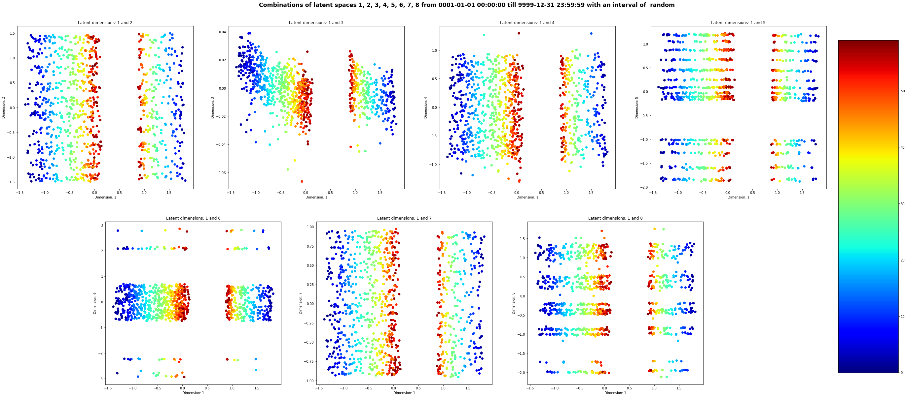

# Timestamp2Vec


1. [About](#about)
2. [Explanation](#explanation)
3. [Usage](#usage)
    1. [Example Usage Vector Embeddings](#example---create-vector-embeddings)
    2. [Visualization Latent Space Consecutive Timestamps](#example---visualize-latent-space---consecutive-timestamps)
    3. [Visualization Latent Space Random Timestamps](#example---visualize-latent-space---random-timestamps)
4. [How to run](#how-to-run)

# About
This Repository is made for the Bachelor Thesis of Gideon Rouwendaal (2022). It contains an explanation about  Timestamp2Vec, information about the usage and information about the VAE and NAS. Timestamp2Vec, the repository, also contains a Visualization and Evaluation Notebook. The Visualization Notebook can be used to visualize the latent space created by the model. The Evaluation Notebook demonstrates how timestamps can be vectorized by Timestamp2Vec. In addition, an evaluation of the model is performed. <br>
In the VAE folder, a VAE Notebook can be found that will create and train a Variational Autoencoder. The encoder of this VAE is used in the Timestamp2Vec model. <br>
In the NAS folder, a NAS Notebook can be found. Neural Architecture Search (NAS) has been used to approximate the  optimal arhicture for the VAE.

# Explanation
The Timestamp2Vec model consists of 2 parts: a feature extractor and an encoder, which is originally part of a variational autoencoder (VAE). The input of Timestamp2Vec is a timestamp in the shape YYYY-MM-DD HH:MM:SS and is of type String. The output of the model is a numpy array of shape (1, 8).

# Usage
Timestamp2Vec is used to vectorize timestamps. To load the model, import the Timestamp2Vec Class from Timestamp2Vec.py from the Timestamp2Vec_Class folder and create an instance of it. Use the __call__ method to retrieve the embedding.
## Example - Create Vector Embeddings
```python
from Timestamp2Vec_Class.Timestamp2Vec import *

timestamp2vec = Timestamp2Vec()
vectorized = timestamp2vec("2000-01-01 00:00:00")
print(vectorized)
```

## Output - Vector Embeddings
```
array([[-2.7181404 , -1.6645893 ,  0.06427887, -1.684483  ,  0.0221834 ,
        -0.05639424,  1.3969079 ,  0.705029  ]], dtype=float32)
```

## Example - Visualize Latent Space - Consecutive Timestamps
```python
from Timestamp2Vec_Class.Timestamp2Vec import *
from Timestamp2Vec_Model.helper_functions import *

timestamp2vec = Timestamp2Vec()

# define the start date
start_date = "2953-03-20 12:00:00"

# define the end date
end_date = "2953-03-20 12:17:00"

# use the plot_all_latent_combinations function and pass the start date, end date, the interest, the interval, and the model
plot_all_latent_combinations(start_date, end_date, "s", 1, timestamp2vec)

# use the plot_select_latent_combinations function to plot certain combinations and pass the start date, end date, the interest, the interval, the latent combinations, and the model
plot_select_latent_combinations(start_date, end_date, "s", 1, [[1, 2], [1, 3], [1, 4], [1, 5], [1, 6], [1, 7], [1, 8]], timestamp2vec)
```

## Output - Latent Space - Consecutive Timestamps


## Example - Visualize Latent Space - Random Timestamps
```python
from Timestamp2Vec_Class.Timestamp2Vec import *
from Timestamp2Vec_Model.helper_functions import *

timestamp2vec = Timestamp2Vec()

# define the end date to sample from
start_date = "0001-01-01 00:00:00"

# define the end date to sample from
end_date = "9999-12-31 23:59:59"

# use the plot_sample_individuals function and pass the start date, end date, the interest, the number of samples, the model, and whether the interest should be the same as the start_date
plot_sample_individuals(start_date, end_date, "Y", 1000, timestamp2vec, single_interst=False)

# use the plot_sample_individuals function to plot certain combinations and and pass the start date, end date, the interest, the number of samples, the model, and whether the interest should be the same as the start_date
plot_sample_individuals(start_date, end_date, "Y", 1000, timestamp2vec,  [[1, 2], [1, 3], [1, 4], [1, 5], [1, 6], [1, 7], [1, 8]], single_interst=False)
```

## Output - Latent Space - Consecutive Timestamps



# How to run
1. Clone the Timestamp2Vec repository 
2. Install all the required python packages
```
pip install -r requirements.txt
```
3. (Optional) create the dataset the VAE will be trained on
```
cd ./Timestamp2Vec/Data
python data_creation.py
```
4. (Optional) extract the features from the generated dates (specify the correct file location(s))
```
cd ./Timestamp2Vec/Data
python vectorize_date.py
```
5. (Optional) run the Neural Architectural Search (NAS) Notebook, in order to approximate the optimal parameters of the network (the static architecture provided could be used, but a different architecture could also be explored)
```
cd ./Timestamp2Vec/NAS
jupyter notebook
```
6. (Optional) run the Variational Autoencoder (VAE) Notebook, in order to train the encoder needed for the Timestamp2Vec model. A different architecture for the encoder and decoder could be introduced as opposed to the one in the Notebook. Please specify the required variables and correct file location(s)
```
cd ./Timestamp2Vec/VAE
jupyter notebook
```
7. (Optional) once the VAE has been trained, save the encoder and decoder separately (as coded in the Notebook). Locate the encoder and place the folder of the model in the Timestamp2Vec_Class folder. 
8. Load the model in the file in which the timestamps have to be vectorized
```python
from Timestamp2Vec_Class.Timestamp2Vec import *

timestamp2vec = Timestamp2Vec()
```
9. Use the timestamp2vec object to vectorize the timestamps. Please note that the data types of the to be vectorized timestamps should be Strings.